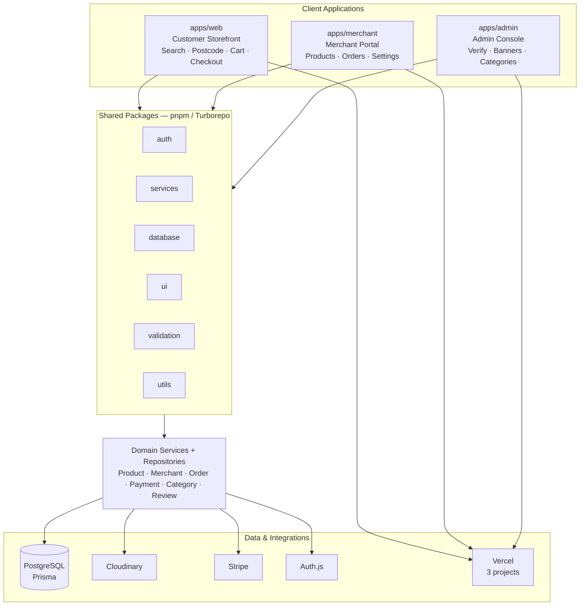

# Architecture diagram prompt (BharatMart UK)

Save the generated image as:

`Report_Sample/architecture.png`

Then recompile `main.tex`. Figure caption in the report:

> High-level monorepo architecture (Web / Merchant / Admin)

---

## Copy this into ChatGPT / Gemini / Claude (image or diagram mode)

```text
Create ONE clean, academic system-architecture diagram for an internship report.

Project: BharatMart UK — Multi-Merchant Grocery Marketplace
Style: professional technical diagram for a B.Tech internship report (like IEEE/college report figures). White or very light cream background (#FFF8F0). No purple gradients, no neon, no 3D glassmorphism, no cluttered icons. Use thin dark borders, clear labels, and BharatMart brand accents sparingly (deep brown-gold #7F5700, terracotta #A83635, deep green #2E6A39).

LAYOUT (top → bottom, left → right):

TITLE (top centre):
"BharatMart UK — System Architecture"

ROW 1 — CLIENT APPS (three equal boxes side by side):
1) apps/web — Customer Storefront
   bullets: Browse / Search / Postcode gate / Cart / Wishlist / Checkout
2) apps/merchant — Merchant Portal
   bullets: Onboarding / Products / Orders / Store settings
3) apps/admin — Admin Console
   bullets: Verification / Banners CMS / Categories / Orders

ROW 2 — SHARED PACKAGES (one wide horizontal band with 6 small boxes):
@bharatmart/auth | @bharatmart/services | @bharatmart/database |
@bharatmart/ui | @bharatmart/validation | @bharatmart/utils

Label this band: "Shared Monorepo Packages (pnpm + Turborepo)"

ROW 3 — DOMAIN / APPLICATION LAYER (one box):
"Domain Services + Repositories (server-only)"
sub-bullets: Product, Merchant, Order, Payment, Category, Review, Banner

ROW 4 — DATA & EXTERNAL SERVICES (five boxes in a row):
1) PostgreSQL (Prisma ORM)
2) Cloudinary (images & documents)
3) Stripe (PaymentIntents + webhooks)
4) Auth.js sessions (Credentials / Google)
5) Vercel Hosting (3 projects)

ARROWS:
- Draw downward arrows from each of the 3 apps into Shared Packages
- Shared Packages → Domain Services
- Domain Services → PostgreSQL
- Domain Services ↔ Cloudinary, Stripe, Auth.js
- Apps → Vercel (deploy)

SIDE ANNOTATION (small callout on the right or bottom):
"Key customer flows: UK postcode filtering → multi-merchant cart → Stripe/COD checkout"

OUTPUT REQUIREMENTS:
- Landscape diagram, high resolution, readable at A4 print width
- All text must be sharp and spelled correctly
- No fake logos, no QR codes, no watermarks, no decorative people illustrations
- Prefer boxes + arrows over fancy illustrations
- Export as PNG suitable for LaTeX includegraphics (filename architecture.png)
```

---

## Optional: Mermaid version (if you prefer code → diagram)

Paste into [mermaid.live](https://mermaid.live), export PNG as `architecture.png`:



---

## After you generate

1. Save as `Report_Sample/architecture.png`
2. Keep screenshot placeholders until you capture:
   - `homepage.png`
   - `product_favourites.png`
   - `postcode_gate.png`
   - `customer_journey.png` (optional flow screenshot/collage)
3. After internship ends, replace the company-certificate reserved box with `certificate2.png`
