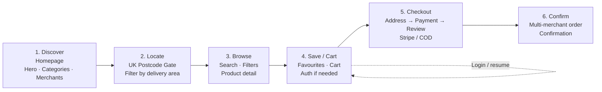

# Customer journey diagram prompt

Save the generated image as:

`Report_Sample/customer_journey.png`

Then in `main.tex`, replace the reserved `\fbox{...}` for Figure~\ref{fig:journey} with:

```latex
\includegraphics[width=0.9\textwidth]{customer_journey.png}
```

---

## Copy this into ChatGPT / Gemini / Claude (image mode)

```text
Create ONE clean academic flowchart image for a B.Tech internship report.

Title (top centre):
"BharatMart UK — Customer Journey"

Purpose:
Show the customer path from landing on the marketplace to placing an order.

Style:
- Professional technical diagram for a college report
- White or light cream background (#FFF8F0)
- Thin dark borders, clear readable text
- Brand accents only: deep brown-gold (#7F5700), terracotta (#A83635), deep green (#2E6A39)
- NO purple gradients, NO neon, NO 3D glassmorphism, NO cartoon people, NO watermarks, NO QR codes
- Flat 2D boxes + arrows only
- Landscape orientation, high resolution, sharp text suitable for A4 print

LAYOUT (left → right horizontal flow, 6 main stages):

1) Discover
   Subtitle: Homepage
   Bullets: Hero carousel · Categories · Featured merchants

2) Locate
   Subtitle: UK Postcode Gate
   Bullets: Enter postcode · Soft skip option · Delivery area filter

3) Browse
   Subtitle: Products & Search
   Bullets: Filters/sort · Fuzzy search · Product detail page

4) Save / Cart
   Subtitle: Favourites & Basket
   Bullets: Add to favourites · Add to cart · Auth gate if needed

5) Checkout
   Subtitle: Multi-step Checkout
   Bullets: Address → Payment → Review · Stripe or COD

6) Confirm
   Subtitle: Order Placed
   Bullets: Multi-merchant orders · Confirmation · Account/orders

ARROWS:
- Connect stages 1→2→3→4→5→6 with clear rightward arrows
- Small optional loop under stage 4 labeled "Login / Register then resume"

FOOTER CALLOUT (small text strip under the flow):
"Guest can set postcode first; login is required at cart/wishlist/checkout when needed."

OUTPUT:
- Single PNG named customer_journey.png
- All spelling correct, high contrast labels
- Minimal whitespace clutter; balanced spacing between boxes
```

---

## Optional Mermaid (mermaid.live → Export PNG)


