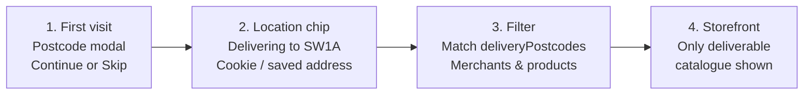

# Postcode gate diagram / UI prompt

Save the generated image as:

`Report_Sample/postcode_gate.png`

Then in `main.tex`, replace the reserved `\fbox{...}` for Figure~\ref{fig:postcode} with:

```latex
\includegraphics[width=0.85\textwidth]{postcode_gate.png}
```

---

## Copy this into ChatGPT / Gemini / Claude (image mode)

```text
Create ONE clean academic product-UX diagram for a B.Tech internship report.

Title (top centre):
"BharatMart UK — Postcode Gate & Delivery Filtering"

Purpose:
Explain how a guest sets a UK delivery postcode, can skip, and how products/merchants are filtered by delivery area.

Style:
- Professional college-report figure (not a flashy marketing poster)
- White / light cream background (#FFF8F0)
- Brand accents: brown-gold (#7F5700), terracotta (#A83635), deep green (#2E6A39)
- Flat 2D UI cards + arrows; sharp readable text
- NO purple gradients, NO neon glow, NO 3D glass, NO cartoon mascots, NO watermarks, NO QR codes
- Landscape, high resolution, suitable for A4 print width

LAYOUT (left → right, 4 panels connected by arrows):

PANEL 1 — Soft Gate Modal
Label: "1. First visit"
Show a centred modal card titled "Enter your delivery postcode"
Contents inside modal:
- Short helper text: "See merchants who deliver to your area"
- Input field placeholder: "e.g. SW1A 1AA"
- Primary button: "Continue"
- Secondary text link: "Skip for now"
Caption under panel: Guest soft-gate (login not required)

PANEL 2 — Location Chip
Label: "2. Header location"
Show a simple website header strip with:
- Logo text "BharatMart"
- A location chip reading "Delivering to SW1A"
- Search bar outline
Caption: Postcode stored (cookie) and shown in header

PANEL 3 — Filtering Logic
Label: "3. Delivery filter"
Show a box titled "Filter catalogue"
Bullets:
- Match customer postcode
- Against merchant deliveryPostcodes[]
- Hide out-of-area sellers/products
Caption: Domain services filter merchants & products

PANEL 4 — Result
Label: "4. Filtered storefront"
Show a simple product grid of 4 cards (generic food labels like Pickles, Snacks) with a small badge "Delivers to your area"
Caption: User only sees deliverable options

BOTTOM STRIP (full width callout):
"Logged-in users: postcode comes from default/saved address (no guest modal). Guests may skip and browse all, with a reminder banner."

OUTPUT:
- Single PNG named postcode_gate.png
- Correct British English spelling (postcode, favour, colour if used)
- Clear stage numbers 1–4
- Balanced spacing, high contrast labels
```

---

## Optional Mermaid flow (mermaid.live → Export PNG)


